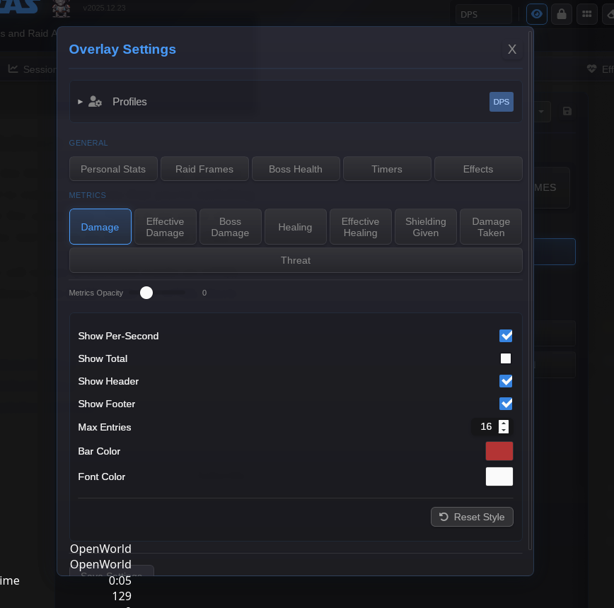
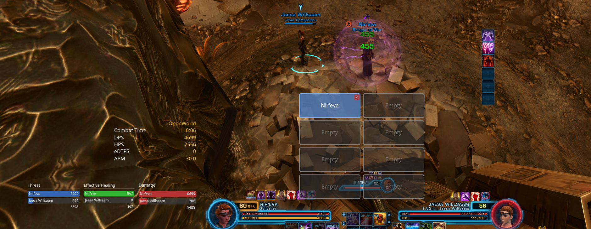
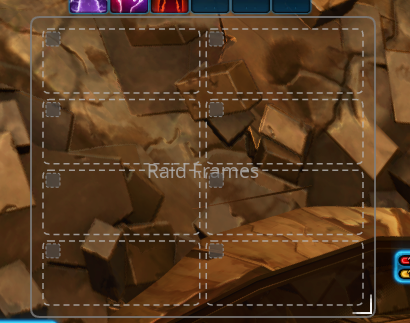
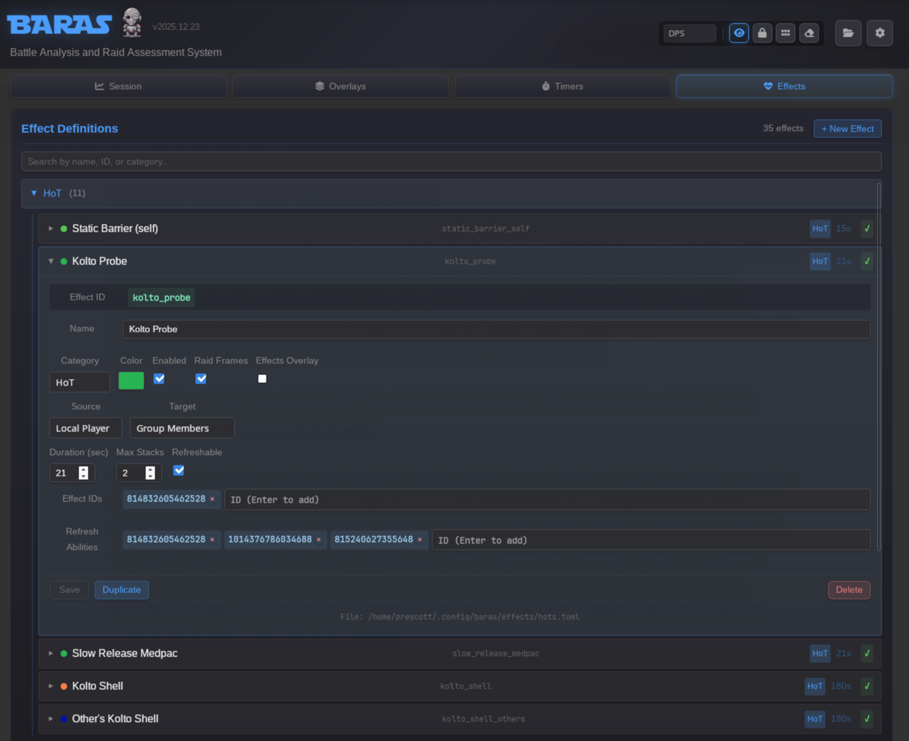
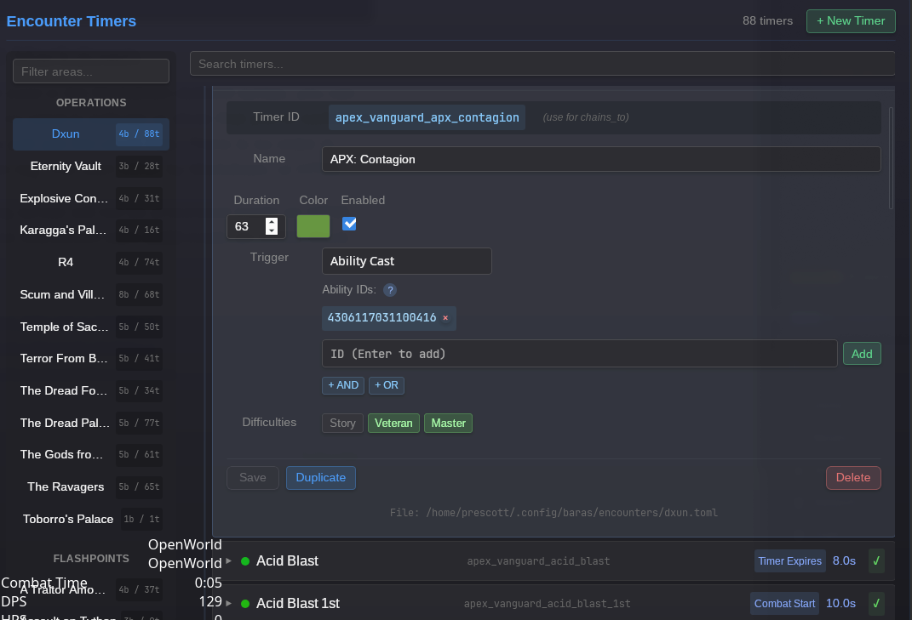
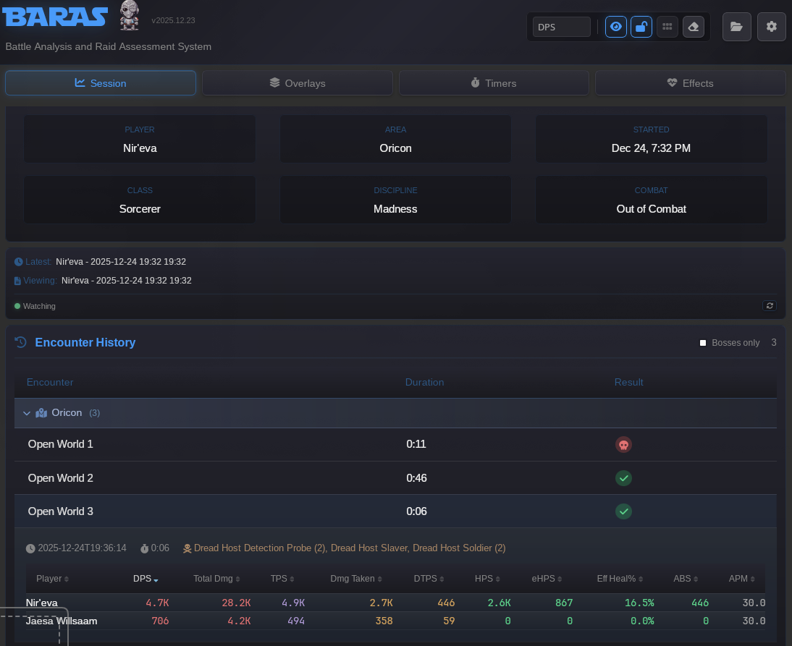

# BARAS

The **Battle Analysis and Raid Assessment System** (BARAS) is the ultimate companion for SWTOR endgame content.

  

**NOTE**: BARAS is still undergoing active development and is not yet complete. Find a bug? Have a feature you want added? Let us know!

## Features

### General

**No Auto-updates, no "anonymous" statistics, no bloat**

- **Lean** - Unlike Darth Baras the Wide, BARAS is tiny. Pure Rust, event-driven, smart caching that only loads the data you need.
- **Fast** - BARAS will chew through even the largest log files quicker than you can blink.
- **Linux Wayland Support** - Play SWTOR on Linux? BARAS has first-class support for Wayland-based desktop environments! Buttery smooth overlay movement, cross-monitor dragging, and position saving all supported. On Linux it should "just work".
- **Global Keyboard Shortcuts** (Windows Only) - Save keyboard shortcuts to toggle overlays on and off, to lock and unlock raid frames.
- **Minimize to system Tray** - Declutter your desktop. Let BARAS run in the background and access it from the system tray. It's so tiny you might not even know it's there.
- **File Management** - Load in historical files, easily see the character and date. Set BARAS to automatically delete empty files and old logs.
- **Parsely Integration** - Upload logs directly to parsely.io from the UI.

### Overlays

**Smooth dragging, intuitive management, highly customizable**

  

- **Customization** - All overlays come with a variety of customization options. Choose your own colors, background opacity, and more for every element on the screen.
- **Profiles** - Save up to 12 overlay profiles that you can swap between in a flash.

  

- **Real-time Metrics** - Overlays for common metrics such as DPS, EHPS, and Threat.
- **Raid Frames** - A click-to-swap raid frame that displays HoTs and other raid effects. No dragging. No agonizing waits for the final player sitting on fleet to zone into the phase.
  - Click where you want a player to go anytime, anywhere!
  - Preset 4, 8, or 16 man configurations and be ready to heal any raid frame configuration!
  - Separate swap and move modes, never accidentally move your frames again!

  
    
  

- **Boss Health** - Smooth rendering of boss health. Disappears when the combat ends, no screen clutter.
- **Personal Statistics** - Pick and choose your own set of personal statistics and encounter information.

### Effects and Timers

- **Effects** - Monitor buffs, debuffs, and cooldowns. Build your own effect logic that you can choose to show on the raid frame or a dedicated overlay. You can choose the color for every effect!

  

- **Timers & Alerts** - Fully configurable feature rich interface for building timers. Build your own timers with complex conditions.

  

- **Encounter History** - View summary statistics of past encounters, with an intelligent classification system so you can easily find a specific pull.

  

## Planned Features

- [ ] Complete data exploration tool
- [ ] Raid challenges and boss phase tracking
- [ ] Community curated set of default Timers and effects
- [ ] Timer/effect icons and audio cues
- [ ] PvP Support
- [ ] Class and ability icons

## Platform Support

| Platform      | Status                                                                   |
| ------------- | ------------------------------------------------------------------------ |
| Windows 10/11 | Fully supported                                                          |
| Linux         | Wayland DEs that support zwlr layershell (KDE, Sway, Hyprland, and more) |

## Installation

### Windows

1. Download the latest release from the [Releases page](https://github.com/baras-app/baras/releases)
2. Extract the archive
3. Run `baras.exe`

### Linux

1. Download the latest release from the [Releases page](https://github.com/baras-app/baras/releases)
2. Extract the archive
3. Make executable: `chmod +x baras`
4. Run `./baras`

## Quick Start

1. **Enable Combat Logging in SWTOR**
   - In-game: Preferences → Combat Logging → Enable Combat Logging
   - Or use the command: `/combatlog`

2. **Point BARAS to your logs**
   - BARAS will automatically look for the default combat log directory
   - Or manually set it in Settings → Log Directory

3. **Configure your overlays**
   - Enable the overlays you want in Overlays
   - Position and resize them by dragging
   - Lock them in place when you're done. (Note: overlay positions only save when locked)

## Configuration

Configuration files are stored in:

- **Windows**: `%APPDATA%\baras\`
- **Linux**: `~/.config/baras/`

All configuration files are in a human readable TOML format.

- `config.toml` - the primary configuration file saving global settings and overlay profiles
- `encounters` - timer definitions for bosses. Adding a file in the same format will load it into the app.
- `effects` - definitions for effects

## Disclaimer

BARAS is a fan-made project and is not affiliated with, endorsed by, or connected to Electronic Arts Inc., Broadsword Online Games Inc., or Lucasfilm Ltd.

Star Wars: The Old Republic and all related properties, including logos, character names, and game assets, are trademarks or registered trademarks of Lucasfilm Ltd. and/or Electronic Arts Inc.

This project is provided free of charge for personal, non-commercial use only.

## License

[MIT License](LICENSE.txt)
